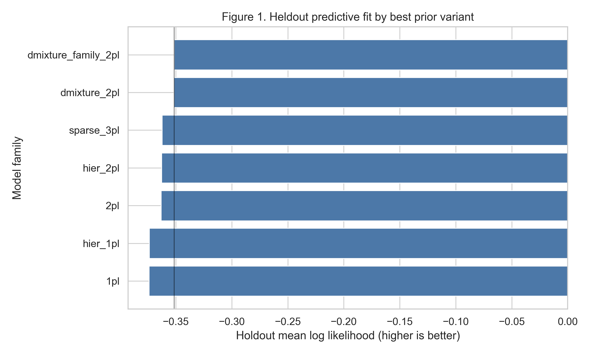
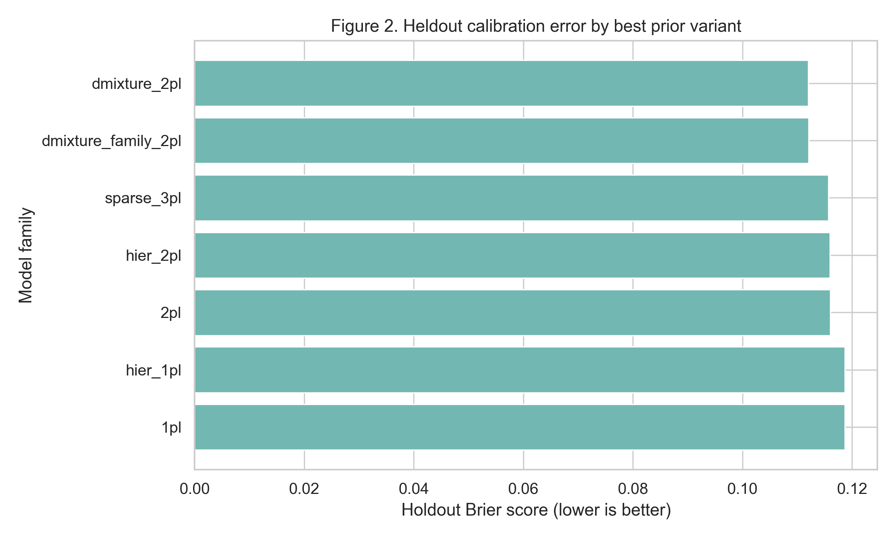
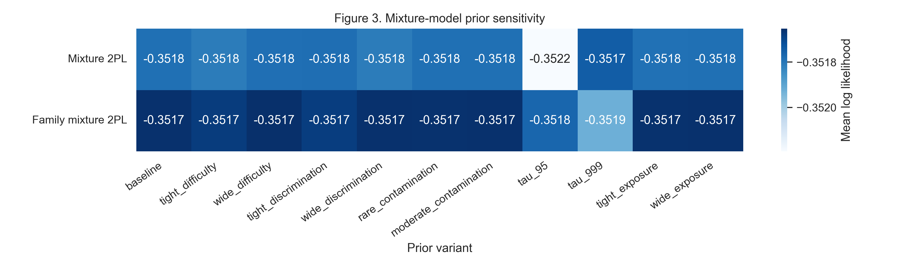
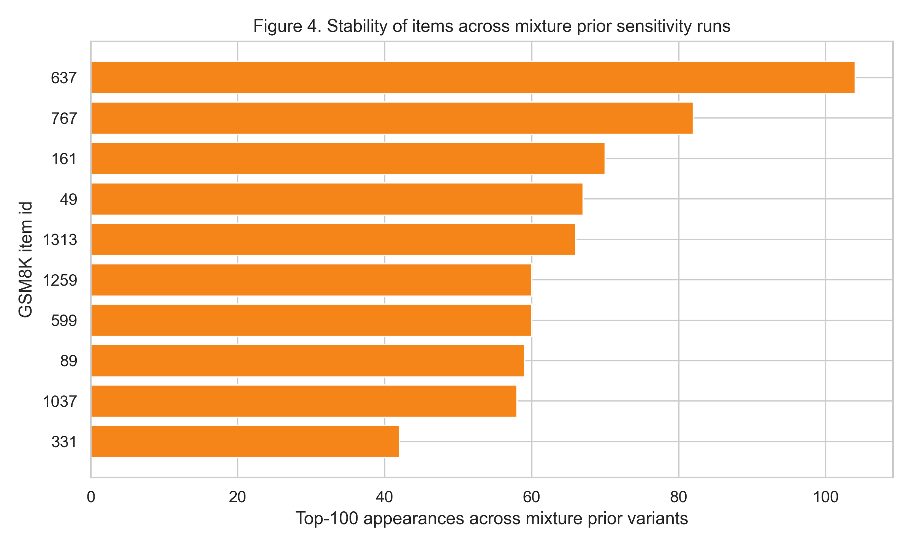
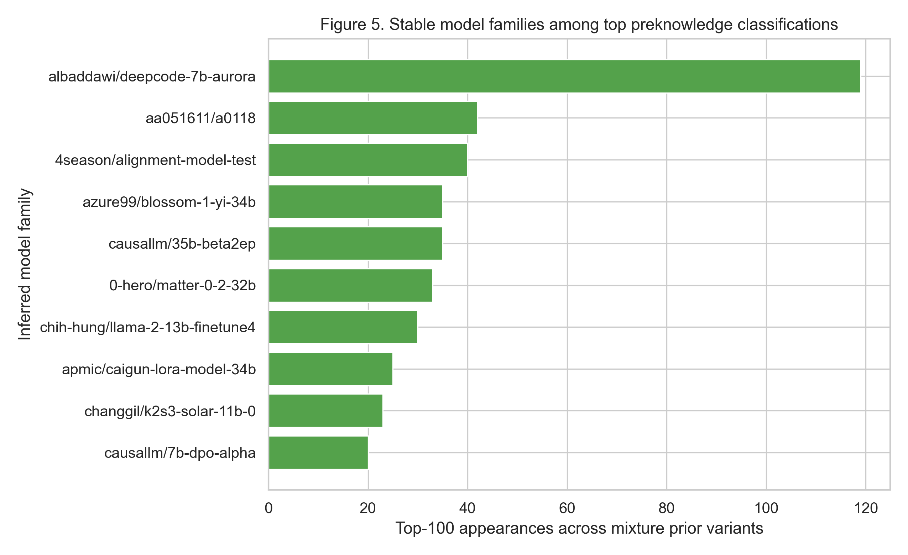
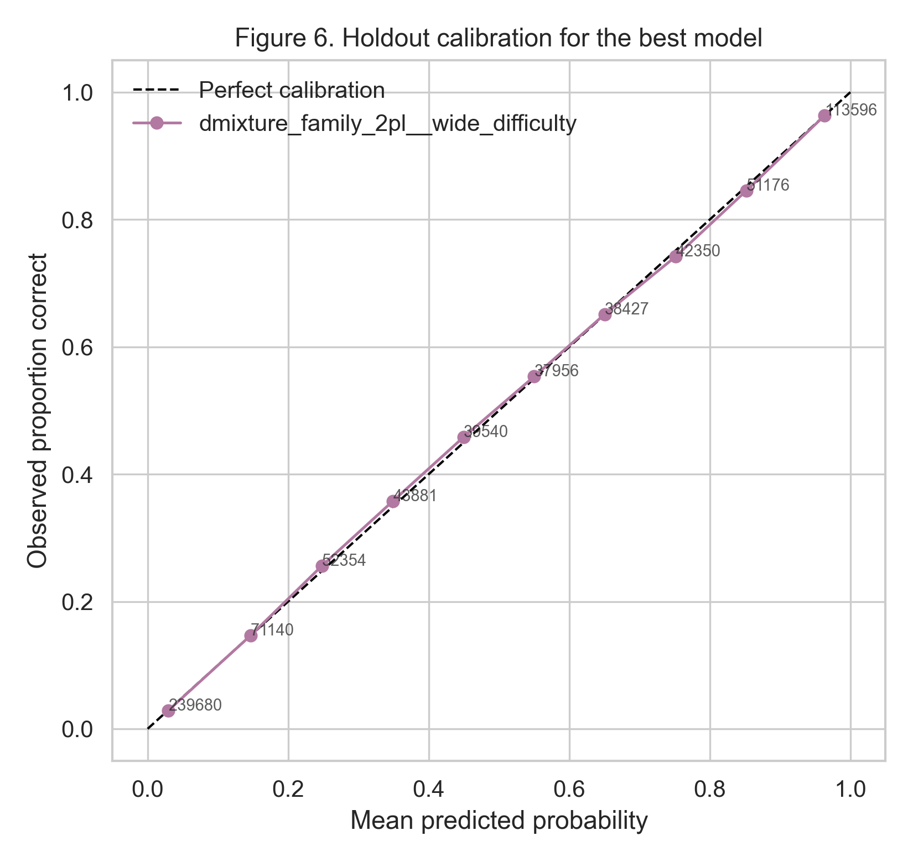
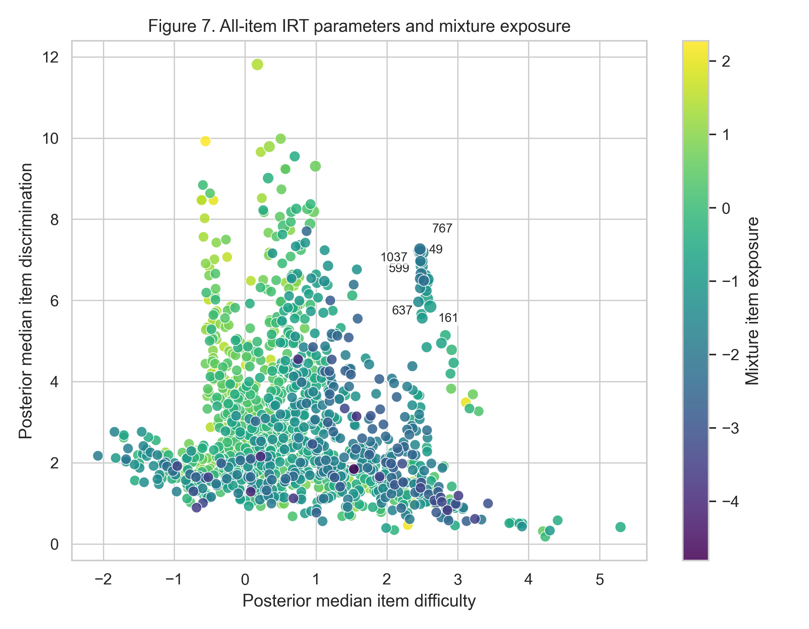
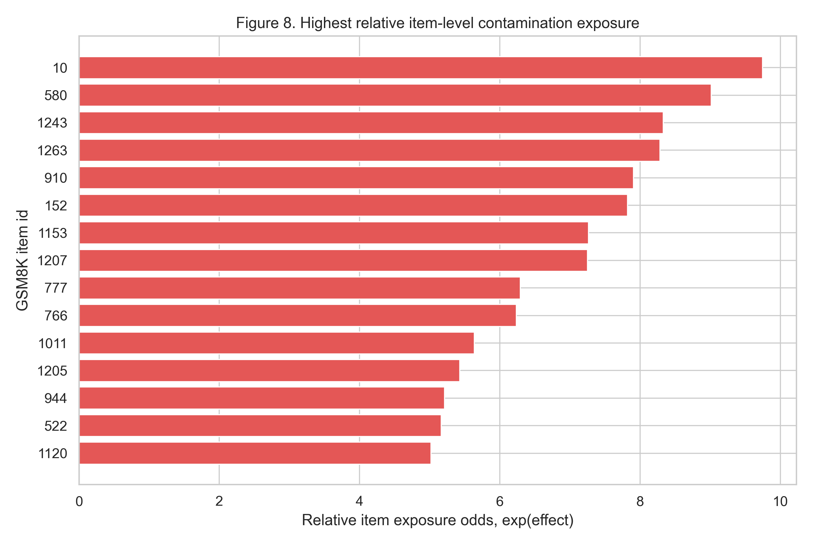
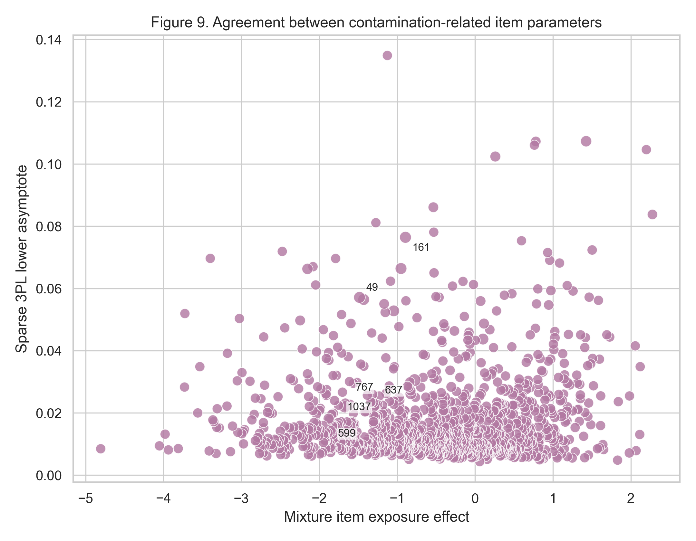
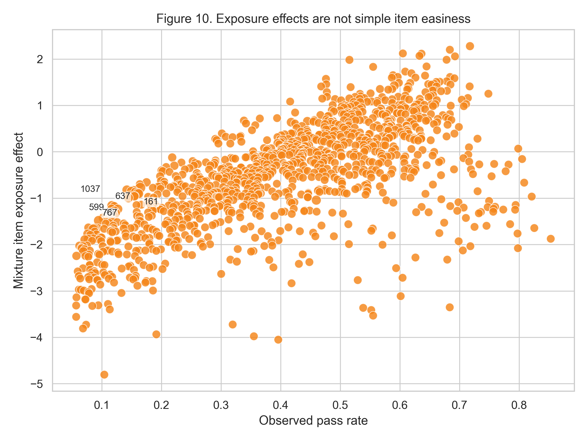

# Classifying Benchmark Preknowledge in Large Language Models With Bayesian Mixture Item Response Theory

## Target Outlet

Journal of Classification, special issue: Advances in Mixture Models for Complex Data.

Submission deadline from the local call PDF: November 30, 2026.

## Abstract

Benchmark contamination threatens the validity of large language model evaluation by allowing models to answer test items from exposure rather than latent capability. We propose a Bayesian mixture item response theory model that treats benchmark contamination as item preknowledge. For open-response mathematics benchmarks such as GSM8K, ordinary random guessing is effectively zero, so lower-asymptote-like success among low-probability model-item pairs is interpreted as evidence for a second response process. The proposed model constrains item difficulty and discrimination to the intended ability-driven response process while adding a deterministic preknowledge class with model, item, and family exposure effects. Applied to 6,014 models and 1,214 non-saturated GSM8K items, deterministic mixture models outperform 1PL, 2PL, hierarchical 2PL, and sparse 3PL baselines on heldout prediction. The best all-item run is a family-aware deterministic mixture, and the highest-probability item classifications recur across mixture prior sensitivity variants. A simulation study is proposed to evaluate classification accuracy, false-positive control, and robustness under family dependence, hidden multidimensionality, and imperfect memorization. The framework contributes a mixture classification method for complex model-by-item benchmark data and a practical audit pipeline for prioritizing perturbation experiments.

## Introduction

Public benchmark scores now do a large amount of institutional work in artificial intelligence. They rank systems, shape claims about progress, guide deployment decisions, and determine which model families are treated as credible scientific or commercial alternatives. This gives benchmark data a role that is recognizably psychometric: a score is useful only to the extent that it supports the intended inference about the respondent. In educational and psychological testing, validity is not a property of a test form in isolation, but of the interpretation made from observed responses (American Educational Research Association et al., 2014; Messick, 1995). The same logic applies to large language model evaluation. A model that solves a held-out mathematics problem may be demonstrating general reasoning ability, but it may also be reproducing an item, solution, or near-duplicate encountered before evaluation.

Data contamination is therefore not only a corpus-management problem. It is a response-process problem. If a benchmark item has been included in pretraining, instruction tuning, retrieval augmentation, synthetic distillation, or derivative benchmark materials, the correct response may arise from a different latent process than the one the benchmark was designed to measure. That distinction matters most for benchmarks such as GSM8K, where the intended construct is multi-step grade-school mathematical reasoning (Cobbe et al., 2021). A correct answer to an open-response problem is unlikely to be produced by blind guessing. When unexpectedly high success appears among model-item pairs that should have low success probability given model ability and item difficulty, the anomaly resembles item preknowledge more than ordinary chance.

Most contamination research in language-model evaluation begins from text or from benchmark construction. Investigators search training corpora for overlapping strings, compare benchmark items with web snapshots, design dynamic evaluations whose answers change over time, or build benchmark variants intended to be difficult to memorize (Chen et al., 2025; Deng et al., 2023; Ravaut et al., 2024; Sainz et al., 2023; White et al., 2024; Wu et al., 2025; Xu et al., 2024). These methods are indispensable because they can sometimes identify a plausible contamination source. However, they are limited when training corpora are not public, when contamination occurs through paraphrase or solution traces rather than exact strings, or when the empirical question is not whether an item exists somewhere on the web but whether a particular model-item response is unusually successful. The present article develops a complementary measurement approach: infer preknowledge from the pattern of responses after adjusting for model ability and item properties.

Item response theory (IRT) is a natural foundation for this approach. In Rasch, one-parameter logistic, and two-parameter logistic models, observed binary responses are explained by a latent respondent trait and item parameters such as difficulty and discrimination (Birnbaum, 1968; Hambleton et al., 1991; Lord, 1980; Rasch, 1960). IRT has already been used to study machine-learning benchmarks and language-model leaderboards because it separates model ability from item informativeness (Kipnis et al., 2024; Lalor et al., 2016; Martinez-Plumed et al., 2019; Nadeem et al., 2025; Rodriguez et al., 2021; Zhou et al., 2025). Yet ordinary IRT assumes a single response process. A correct response from a low-ability model on a difficult item is treated as random residual variation unless the model is extended. In multiple-choice educational testing, a three-parameter logistic model adds a lower asymptote for guessing (Birnbaum, 1968; Lord, 1980). For GSM8K-style open response, that interpretation is weak: the chance of guessing the exact answer and producing a valid chain of reasoning is effectively negligible. A lower-asymptote-like signal is therefore more plausibly read as a second response process.

Finite mixture models provide a principled way to represent such heterogeneity (McLachlan & Peel, 2000). In mixture IRT, different latent classes may follow different response functions, allowing item compromise, item parameter drift, subpopulation differences, or response-style heterogeneity to be modeled directly rather than absorbed into residuals (Frick et al., 2016). The approach proposed here treats benchmark contamination as a deterministic or near-deterministic preknowledge class. For each model-item cell, the ordinary class follows a 2PL response curve. The preknowledge class succeeds with probability near one. The probability of class membership is modeled using item, model, and model-family exposure effects. This produces a posterior probability that a given correct response was generated by preknowledge rather than by the ordinary ability-driven process.

The model is designed for the kind of complex data emphasized in the Journal of Classification special issue on Advances in Mixture Models for Complex Data. LLM benchmark responses are high-dimensional, sparse, crossed, and clustered. Rows are not independent examinees in the usual psychometric sense: a leaderboard can contain base models, fine-tunes, merges, quantizations, and checkpoints from the same model family. Items are not interchangeable Bernoulli trials: they contain text, solutions, difficulty, and possible public exposure histories. The response array is binary, but its interpretation depends on latent ability, item parameters, model lineage, and a potentially rare contamination process. A mixture classification model is therefore not merely a more flexible predictor; it is a way to classify response mechanisms in a complex crossed data structure.

This article has four goals. First, it formulates a Bayesian deterministic-mixture IRT model for open-response benchmark contamination. Second, it compares the mixture model with 1PL, hierarchical 1PL, 2PL, hierarchical 2PL, and sparse 3PL alternatives using heldout prediction. Third, it evaluates whether high-probability preknowledge classifications are stable under prior sensitivity analyses. Fourth, it connects the applied GSM8K results to a simulation plan suitable for evaluating classification accuracy, false-positive control, and robustness to family dependence and hidden multidimensionality. The intended contribution is both methodological and practical: a classification framework for mixture models in complex benchmark data, and an auditable workflow for prioritizing confirmatory perturbation experiments.

## Methods

Let \(Y_{mi} \in \{0,1\}\) indicate whether model \(m\) answered GSM8K item \(i\) correctly. The empirical data are arranged as a crossed model-by-item response matrix. Rows correspond to model checkpoints or leaderboard entries and columns correspond to GSM8K items. The analysis in this draft uses the complete available GSM8K item set after excluding exactly saturated items, defined as items with observed pass rate 0 or 1 in the loaded matrix. This exclusion removes columns that cannot identify item-level response curves while avoiding the residual-screen preselection used in a separate exploratory analysis. Final substantive claims about particular items would still require confirmatory perturbation experiments.

The baseline 2PL model is

\[
\Pr(Y_{mi}=1 \mid \theta_m,a_i,b_i) = \operatorname{logit}^{-1}\{a_i(\theta_m-b_i)\},
\]

where \(\theta_m\) is model ability, \(a_i>0\) is item discrimination, and \(b_i\) is item difficulty. Higher values of \(\theta_m\) increase the probability of success, higher values of \(b_i\) make the item more difficult, and higher values of \(a_i\) make the item more discriminating around its difficulty point. The 1PL/Rasch comparison model fixes \(a_i=1\), yielding a common discrimination across items. The hierarchical 1PL and hierarchical 2PL models replace independent abilities with a family-pooled ability structure. Specifically, model ability is centered on an inferred family ability, with separate family-level and model-level scale parameters. This is important because many leaderboard rows are not independent systems; related checkpoints can share training histories, architectures, or fine-tuning data.

A sparse 3PL model was included as an important comparison because contamination in open-response mathematics can masquerade as a lower-asymptote effect. The sparse 3PL response function is

\[
\Pr(Y_{mi}=1) = c_i + (1-c_i)\operatorname{logit}^{-1}\{a_i(\theta_m-b_i)\},
\]

where \(c_i\) is an item-specific floor. In multiple-choice testing, \(c_i\) is often interpreted as guessing. In this application, the prior for \(c_i\) is concentrated near zero because blind guessing is not a plausible substantive explanation for GSM8K success. The sparse 3PL therefore serves as a diagnostic baseline: if a lower-asymptote-like signal appears, the mixture model tests whether that signal is better represented as a second response process with item, model, and family exposure structure.

The primary contamination model is a deterministic finite mixture. For each model-item pair, let \(Z_{mi}=1\) denote preknowledge and \(Z_{mi}=0\) denote ordinary ability-driven responding. Conditional on \(Z_{mi}=0\), responses follow the 2PL. Conditional on \(Z_{mi}=1\), success occurs with probability \(\tau\), fixed near one to allow occasional formatting, extraction, or generation failure:

\[
\Pr(Y_{mi}=1) = (1-\pi_{mi})p_{mi} + \pi_{mi}\tau,
\]

where \(p_{mi}\) is the 2PL probability and \(\pi_{mi}=\Pr(Z_{mi}=1)\) is the prior probability that the cell belongs to the preknowledge class. In the model-by-item version,

\[
\operatorname{logit}(\pi_{mi}) = \alpha + u_i + v_m,
\]

where \(\alpha\) is a global contamination logit, \(u_i\) is an item exposure effect, and \(v_m\) is a model exposure effect. In the family-aware version,

\[
\operatorname{logit}(\pi_{mi}) =
\alpha + u_i + v_m + w_{f[m]},
\]

where \(w_{f[m]}\) captures shared exposure among models in the inferred family \(f[m]\). This term is not intended to prove shared training data. It is a partial-pooling and classification device that reduces the risk of treating many closely related model rows as independent confirmations of the same item anomaly.

The latent class is marginalized analytically during estimation, so the fitted likelihood remains differentiable and scalable. Posterior preknowledge probabilities are then reconstructed by Bayes' rule. For correct responses,

\[
\Pr(Z_{mi}=1 \mid Y_{mi}=1) =
\frac{\pi_{mi}\tau}{(1-\pi_{mi})p_{mi}+\pi_{mi}\tau}.
\]

This posterior probability is the central classification quantity. It is high when the cell has a high exposure probability, the observed response is correct, and the ordinary IRT process assigns relatively low probability to success. The quantity is therefore distinct from item pass rate, residual size alone, or item difficulty alone.

The prior specification was intentionally conservative and sensitivity-checked. Abilities followed standard normal priors in non-hierarchical models. Item difficulties followed zero-centered normal priors with the difficulty scale varied across sensitivity runs. Item discriminations followed lognormal priors with log mean zero and sensitivity over the log standard deviation. Sparse-3PL lower asymptotes followed beta priors concentrated near zero, with sensitivity variants allowing more or less sparsity. Mixture models used a normal prior on the global contamination logit centered at the logit of a base contamination rate, with base-rate variants representing rare and moderate contamination. Item, model, and family exposure effects were normal with half-normal hyperpriors on their scales. The deterministic success probability \(\tau\) was fixed and varied across sensitivity runs.

Models were estimated in Python using Pyro, stochastic variational inference, and an AutoNormal variational guide (Bingham et al., 2019). The fitted suite included 1PL, hierarchical 1PL, 2PL, hierarchical 2PL, sparse 3PL, deterministic mixture 2PL, and family-aware deterministic mixture 2PL. The standard sensitivity suite generated 45 model/prior runs. All runs used the same random 90/10 train-holdout split, 1,000 optimization steps, a learning rate of 0.03, minibatches of up to 50,000 observed cells, and seed 123. Predictive fit was evaluated by heldout mean log likelihood, Brier score, and threshold accuracy (Brier, 1950). Calibration plots were computed for the best predictive model. Mixture classifications were summarized by recurrence across prior variants, focusing on items, models, and model families that repeatedly appeared among the top posterior preknowledge probabilities.

The item-parameter diagnostics in the applied results combine five signals. First, the family-aware mixture item exposure effect estimates whether an item is unusually likely to enter the preknowledge class. Second, the mixture difficulty and discrimination parameters describe the ordinary ability-driven response process for the same item. Third, the sparse-3PL lower asymptote asks whether the item shows a floor-like excess-success signal when exposure is forced to be item-only. Fourth, observed pass rate guards against the trivial explanation that an item receives high exposure merely because it is easy. Fifth, legacy residual-screen flags are retained only as an auxiliary comparison with the earlier exploratory workflow. The most persuasive follow-up targets should show high exposure and stability without being reducible to observed easiness or to item preselection.

### Applied Data and Model Suite

The applied analysis used the filtered GSM8K response matrix in the project folder and retained all items with non-saturated observed pass rates. This produced 1,214 analyzed items and 7,300,996 observed model-item cells. The suite fit 45 model/prior combinations with stochastic variational inference and evaluated all models on the same 10% holdout split.

**Table 1**  
Dataset and model-comparison suite.

| Quantity | Value |
| --- | --- |
| Benchmark | All non-saturated GSM8K items from metabench/Open LLM Leaderboard response data |
| Models/checkpoints | 6,014 |
| Analyzed items | 1,214 |
| Observed model-item cells | 7,300,996 |
| Inferred model families | 5,233 |
| Training observations | 6,570,896 |
| Holdout observations | 730,100 |
| Model/prior runs | 45 |
| Heldout fraction | 0.10 |

*Note.* Items with pass rates exactly 0 or 1 in the loaded matrix were excluded before fitting.

## Applied Results

The all-item analysis used 6,014 model rows, 1,214 non-saturated GSM8K items, and 7,300,996 observed model-item cells. The heldout set contained 730,100 cells, and the training set contained 6,570,896 cells. The model-comparison suite completed all 45 planned model/prior runs without failures. This completion rate is important because the strongest claims in the analysis depend on comparing the mixture results with simpler IRT alternatives under the same train-holdout split, rather than selecting a contamination model after inspecting only in-sample fit.

Predictively, the deterministic mixture models were clearly favored. The best heldout log-likelihood run was the family-aware deterministic mixture with a wide difficulty prior, with heldout mean log likelihood -0.351652, Brier score 0.112065, and threshold accuracy 0.838539. The best non-family deterministic mixture used tau = .999 and achieved heldout mean log likelihood -0.351747, Brier score 0.112010, and accuracy 0.838408. The best sparse 3PL achieved -0.362337, the best hierarchical 2PL achieved -0.362893, and the best ordinary 2PL achieved -0.363162. Thus, adding an item-only lower asymptote improved over ordinary 2PL, but the structured deterministic mixture improved substantially more. The difference is substantively meaningful because the sparse 3PL assigns excess success to an item floor, whereas the mixture model can assign excess success to item, model, and family exposure components.

The ranking of the top runs also supported the mixture interpretation. All ten highest heldout predictive runs were deterministic mixture models, and nine of the ten were family-aware mixture runs. These top family-aware runs represented wide difficulty, wide discrimination, wide exposure, moderate contamination, baseline, rare contamination, tight exposure, tight difficulty, and tight discrimination variants. The near-tie across base-rate and exposure-scale priors is useful because it indicates that the predictive advantage is not an artifact of a single contamination prior. The tau sensitivity was more nuanced: the non-family tau = .999 run had the best Brier score, whereas family-aware tau = .999 was worse than the family-aware baseline group. The main conclusion is therefore not that one fixed tau value is universally optimal, but that deterministic and near-deterministic mixture response processes outperform single-process IRT models on the full item set.

The item classifications were stable even without residual-screen preselection. Across the 22 mixture prior variants, GSM8K items 767, 161, 599, and 1037 appeared in the top-100 posterior preknowledge lists in 21 mixture runs. Items 637, 49, 1313, 1259, and 89 appeared in 20 of 22 mixture runs, and item 331 appeared in 19. The strongest item by top-100 cell count was item 637, with 104 appearances, followed by item 767 with 82, item 161 with 70, item 49 with 67, and item 1313 with 66. Posterior preknowledge probabilities for many top cells saturated near one, so exact rank differences among the strongest cells should not be overinterpreted. The more defensible evidence is recurrence across model variants and priors.

Family recurrence also concentrated in a small set of inferred model families. The most stable families included albaddawi/deepcode-7b-aurora, which appeared in 21 mixture prior variants and contributed 119 top-100 appearances; 4season/alignment-model-test, which appeared in 19 variants; and 0-hero/matter-0-2-32b, which also appeared in 19 variants. These summaries are useful for audit triage, but they should not be read as verified lineage evidence. The family labels are inferred from model names, and open leaderboards often contain aliases, derivative checkpoints, and incomplete provenance. The appropriate interpretation is that these rows share enough response-pattern structure to deserve grouped follow-up.

The item-parameter diagnostics refine the contamination interpretation. A high mixture item exposure effect indicates that an item frequently participates in the preknowledge class after accounting for ability, difficulty, discrimination, model exposure, and family exposure. If this effect were merely a proxy for item easiness, it should closely track observed pass rate. The diagnostic plots show that this is not the full story: high-exposure items are not simply the easiest all-item cases. Likewise, if the signal were only an item-level floor, the sparse 3PL lower asymptote would be sufficient. Instead, the family-aware mixture improves heldout prediction while allowing the same excess-success signal to be decomposed across items, models, and families.

The applied conclusion is therefore intentionally probabilistic. The analysis does not prove that any training corpus contained a particular GSM8K item. It classifies response patterns that are more consistent with preknowledge than with the ordinary IRT response process. The most stable all-item classifications should be treated as the first wave for confirmatory experiments: create difficulty-preserving numeric or semantic twins, administer both the original and twin items to the suspect models, and test whether the original advantage persists after controlling for baseline ability. In this workflow, Bayesian mixture IRT supplies the prioritization mechanism, while perturbation supplies the strongest causal evidence.

**Table 2**  
Best prior variant within each model family.

| Model family | Best prior variant | Holdout mean log likelihood | Holdout Brier score | Holdout accuracy |
| --- | --- | --- | --- | --- |
| dmixture_family_2pl | wide_difficulty | -0.352 | 0.112 | 0.839 |
| dmixture_2pl | tau_999 | -0.352 | 0.112 | 0.838 |
| sparse_3pl | tight_discrimination | -0.362 | 0.116 | 0.832 |
| hier_2pl | tight_discrimination | -0.363 | 0.116 | 0.832 |
| 2pl | tight_discrimination | -0.363 | 0.116 | 0.832 |
| hier_1pl | tight_difficulty | -0.374 | 0.119 | 0.830 |
| 1pl | wide_difficulty | -0.374 | 0.119 | 0.831 |

*Note.* Higher heldout mean log likelihood and lower Brier score indicate better predictive performance.

**Table 3**  
Ten highest heldout predictive runs.

| Run | Model family | Prior variant | Holdout mean log likelihood | Holdout Brier score | Holdout accuracy |
| --- | --- | --- | --- | --- | --- |
| dmixture_family_2pl__wide_difficulty | dmixture_family_2pl | wide_difficulty | -0.352 | 0.112 | 0.839 |
| dmixture_family_2pl__wide_discrimination | dmixture_family_2pl | wide_discrimination | -0.352 | 0.112 | 0.839 |
| dmixture_family_2pl__wide_exposure | dmixture_family_2pl | wide_exposure | -0.352 | 0.112 | 0.839 |
| dmixture_family_2pl__moderate_contamination | dmixture_family_2pl | moderate_contamination | -0.352 | 0.112 | 0.839 |
| dmixture_family_2pl__baseline | dmixture_family_2pl | baseline | -0.352 | 0.112 | 0.839 |
| dmixture_family_2pl__rare_contamination | dmixture_family_2pl | rare_contamination | -0.352 | 0.112 | 0.839 |
| dmixture_family_2pl__tight_exposure | dmixture_family_2pl | tight_exposure | -0.352 | 0.112 | 0.839 |
| dmixture_family_2pl__tight_difficulty | dmixture_family_2pl | tight_difficulty | -0.352 | 0.112 | 0.839 |
| dmixture_family_2pl__tight_discrimination | dmixture_family_2pl | tight_discrimination | -0.352 | 0.112 | 0.838 |
| dmixture_2pl__tau_999 | dmixture_2pl | tau_999 | -0.352 | 0.112 | 0.838 |

*Note.* All top ten runs are deterministic mixture models, with family-aware mixtures dominating the leading positions.

**Table 4**  
Stable items across mixture prior variants.

| Item | Mixture runs | Top-100 appearances | Mean rank | Best rank | Mean posterior preknowledge probability | Minimum posterior preknowledge probability |
| --- | --- | --- | --- | --- | --- | --- |
| 767 | 21 | 82 | 49.110 | 2 | 1.000 | 1.000 |
| 161 | 21 | 70 | 50.186 | 2 | 1.000 | 1.000 |
| 599 | 21 | 60 | 58.383 | 4 | 1.000 | 1.000 |
| 1037 | 21 | 58 | 49.310 | 4 | 1.000 | 1.000 |
| 637 | 20 | 104 | 49.356 | 1 | 1.000 | 1.000 |
| 49 | 20 | 67 | 52.821 | 1 | 1.000 | 1.000 |
| 1313 | 20 | 66 | 48.773 | 1 | 1.000 | 1.000 |
| 1259 | 20 | 60 | 50.500 | 3 | 1.000 | 1.000 |
| 89 | 20 | 59 | 44.831 | 1 | 1.000 | 1.000 |
| 331 | 19 | 42 | 54.405 | 6 | 1.000 | 1.000 |

*Note.* There were 22 mixture prior variants: 11 deterministic mixture 2PL variants and 11 family-aware deterministic mixture 2PL variants. Top-100 appearances count how often an item appears among the 100 highest posterior preknowledge probabilities in those runs.

### Item-Parameter Diagnostics for Contamination

The mixture model is useful only if its contamination-related parameters can be separated from ordinary item quality. We therefore inspected item difficulty, discrimination, item-level exposure effects from the best family-aware deterministic mixture, sparse-3PL lower asymptotes, observed pass rates, and legacy residual-screen flags. These diagnostics ask whether stable all-item classifications are merely easy, poorly discriminating, or associated with a lower-asymptote-like response process concentrated among particular models and families.

The strongest contamination-relevant items were not simply the easiest items in the all-item set. Items with high posterior item exposure also tended to be repeatedly classified across prior sensitivity variants, whereas observed pass rate alone did not explain the exposure ordering. This pattern supports the interpretation that the mixture item-exposure parameter is measuring an additional response-process signal rather than rediscovering item easiness. The sparse-3PL lower-asymptote comparison is also informative: when lower asymptote and mixture exposure agree, both models are detecting excess success among low-baseline-probability model-item pairs; when they diverge, the mixture model is preferable because it allows the anomaly to be attributed to item, model, and family exposure components rather than assigning all excess success to an item-only floor.

**Table 5**  
Top contamination-relevant item-parameter diagnostics.

| Item | Exposure | Difficulty | Discrimination | 3PL floor | Pass rate | Mixture variants | Top-100 cells | Legacy flags |
| --- | --- | --- | --- | --- | --- | --- | --- | --- |
| 767 | -1.672 | 2.461 | 7.211 | 0.022 | 0.085 | 21.000 | 82.000 | 0.000 |
| 161 | -0.893 | 2.613 | 5.848 | 0.076 | 0.160 | 21.000 | 70.000 | 0.000 |
| 599 | -1.381 | 2.509 | 6.501 | 0.010 | 0.120 | 21.000 | 60.000 | 0.000 |
| 1037 | -1.160 | 2.519 | 6.497 | 0.016 | 0.117 | 21.000 | 58.000 | 0.000 |
| 637 | -0.776 | 2.559 | 6.036 | 0.031 | 0.165 | 20.000 | 104.000 | 0.000 |
| 49 | -1.483 | 2.488 | 6.964 | 0.057 | 0.095 | 20.000 | 67.000 | 0.000 |
| 1313 | -0.951 | 2.557 | 6.478 | 0.066 | 0.147 | 20.000 | 66.000 | 0.000 |
| 1259 | -0.905 | 2.543 | 6.341 | 0.016 | 0.162 | 20.000 | 60.000 | 0.000 |
| 89 | -0.993 | 2.565 | 6.445 | 0.013 | 0.145 | 20.000 | 59.000 | 0.000 |
| 331 | -1.895 | 2.472 | 7.206 | 0.013 | 0.071 | 19.000 | 42.000 | 15.000 |
| 205 | -1.430 | 2.493 | 6.843 | 0.056 | 0.103 | 18.000 | 63.000 | 0.000 |
| 556 | -0.824 | 2.534 | 6.469 | 0.026 | 0.142 | 18.000 | 58.000 | 0.000 |
| 1154 | -1.279 | 2.578 | 6.517 | 0.023 | 0.121 | 18.000 | 52.000 | 0.000 |
| 1197 | -2.151 | 2.467 | 7.266 | 0.066 | 0.069 | 18.000 | 44.000 | 0.000 |
| 1137 | 0.659 | 0.993 | 9.305 | 0.017 | 0.445 | 18.000 | 30.000 | 0.000 |

*Note.* Mixture item exposure, difficulty, and discrimination are posterior medians from the best family-aware deterministic mixture. Sparse 3PL lower asymptote is the posterior median item floor from the sparse 3PL baseline. Top-100 appearances are counted across all mixture prior variants.

## Planned Simulation Study

The simulation study should establish when the proposed classifier recovers true preknowledge and when it mistakes other forms of model misfit for contamination. The data-generating design should vary sample size, item count, model-family dependence, contamination rate, contamination topology, contamination strength, nuisance dimensionality, and response noise. Each replication would simulate item parameters, model abilities, family effects, and a latent exposure matrix. The uncontaminated process would follow a 2PL model; the contaminated process would generate successes with probability tau.

The most important simulation conditions are not only the favorable ones. Null conditions with no contamination are needed to estimate false-positive rates. Multidimensional no-contamination conditions are needed to test whether hidden subskills induce spurious preknowledge classifications. Family-clustered contamination conditions are needed because open LLM leaderboards contain many descendants, merges, fine-tunes, and quantizations. The simulation should compare residual screening, 2PL, hierarchical 2PL, sparse 3PL, deterministic mixture 2PL, and family-aware deterministic mixture 2PL under the same heldout split and classification thresholds.

Primary classification outcomes should include AUC, PR-AUC, precision@k, recall@k, item-level recall, family-level recall, and false discoveries under the null. Predictive outcomes should include heldout log likelihood, Brier score, and calibration. Parameter recovery outcomes should include RMSE and bias for theta, a, b, and exposure effects. The planned reporting should emphasize classification stability and calibration rather than relying on a single threshold, because benchmark auditing is a triage problem: the goal is to prioritize scarce perturbation experiments with known uncertainty.

**Table 6**  
Planned simulation design.

| Factor | Levels | Rationale |
| --- | --- | --- |
| N models | 500, 2,000, 6,000 | Tests scaling from small audit to metabench scale. |
| I items | 50, 200, 1,200 | Separates small audit and full-benchmark regimes. |
| Family clustering | none, moderate, strong | Controls dependence among related checkpoints. |
| Contamination rate | 0, 0.5%, 2%, 5%, 10% | Includes null and sparse-to-moderate leakage. |
| Contamination topology | cell, item, model, family, crossed | Matches competing substantive mechanisms. |
| Contamination strength tau | 0.85, 0.95, 0.99 | Allows imperfect memorization or formatting failures. |
| Latent dimensionality | 1D, 2D nuisance skill | Tests false positives under unmodeled subskills. |
| Answer noise | 0%, 2%, 5% | Mimics extraction and generation errors. |
| Replications | 100 per core cell | Targets Monte Carlo SE below .02 for classification metrics. |
| Evaluation | AUC, PR-AUC, precision@k, recall@k, calibration, RMSE, coverage, false positives | Connects classification, prediction, and parameter recovery. |

*Note.* The simulation is designed for classification performance, not only parameter recovery.

## Discussion

The applied results support the value of mixture modeling for complex benchmark data. The improvement of deterministic mixture models over ordinary IRT baselines suggests that some GSM8K model-item successes are better represented by a second response process than by ability and item difficulty alone. The family-aware version is particularly important because open leaderboards contain many related checkpoints. Treating those rows as exchangeable independent examinees would overstate evidence for item-level recurrence. The family-aware model instead separates item susceptibility, model exposure, and family exposure.

These findings should remain carefully framed. The analysis classifies preknowledge-like response patterns. It does not prove that a particular training corpus contained a particular GSM8K item. The posterior classifications are best interpreted as a principled queue for confirmatory perturbation: items that recur across prior variants should be rewritten into difficulty-preserving twins and administered to the suspect models. A model that succeeds on the original but fails the twin offers stronger evidence of memorization than either string overlap or residual anomaly alone.

## References

American Educational Research Association, American Psychological Association, & National Council on Measurement in Education. (2014). Standards for educational and psychological testing. American Educational Research Association.

Bingham, E., Chen, J. P., Jankowiak, M., Obermeyer, F., Pradhan, N., Karaletsos, T., Singh, R., Szerlip, P., Horsfall, P., & Goodman, N. D. (2019). Pyro: Deep universal probabilistic programming. Journal of Machine Learning Research, 20(28), 1-6.

Birnbaum, A. (1968). Some latent trait models and their use in inferring an examinee's ability. In F. M. Lord & M. R. Novick (Eds.), Statistical theories of mental test scores (pp. 397-479). Addison-Wesley.

Bock, R. D., & Aitkin, M. (1981). Marginal maximum likelihood estimation of item parameters: Application of an EM algorithm. Psychometrika, 46(4), 443-459.

Brier, G. W. (1950). Verification of forecasts expressed in terms of probability. Monthly Weather Review, 78(1), 1-3.

Buerkner, P.-C. (2021). Bayesian item response modeling in R with brms and Stan. Journal of Statistical Software, 100(5), 1-54.

Chen, S., Chen, Y., Li, Z., Jiang, Y., Wan, Z., He, Y., Ran, D., Gu, T., Li, H., Xie, T., & Ray, B. (2025). Benchmarking large language models under data contamination: A survey from static to dynamic evaluation. Proceedings of EMNLP.

Cobbe, K., Kosaraju, V., Bavarian, M., Chen, M., Jun, H., Kaiser, L., Plappert, M., Tworek, J., Hilton, J., Nakano, R., Hesse, C., & Schulman, J. (2021). Training verifiers to solve math word problems. arXiv:2110.14168.

Deng, C., Zhao, Y., Tang, X., Gerstein, M., & Cohan, A. (2023). Investigating data contamination in modern benchmarks for large language models. arXiv:2311.09783.

Fraley, C., & Raftery, A. E. (2002). Model-based clustering, discriminant analysis, and density estimation. Journal of the American Statistical Association, 97(458), 611-631.

Frick, H., Strobl, C., & Zeileis, A. (2016). Investigating the impact of item parameter drift for item response theory models with mixture distributions. Frontiers in Psychology, 7, 255.

Hambleton, R. K., Swaminathan, H., & Rogers, H. J. (1991). Fundamentals of item response theory. Sage.

Hendrycks, D., Burns, C., Basart, S., Zou, A., Mazeika, M., Song, D., & Steinhardt, J. (2021). Measuring massive multitask language understanding. International Conference on Learning Representations.

Kiela, D., Bartolo, M., Nie, Y., Kaushik, D., Geiger, A., Wu, Z., Vidgen, B., Prasad, G., Singh, A., Ringshia, P., Ma, Z., Thrush, T., Riedel, S., Waseem, Z., Stenetorp, P., Jia, R., Bansal, M., Potts, C., & Williams, A. (2021). Dynabench: Rethinking benchmarking in NLP. Proceedings of NAACL-HLT, 4110-4124.

Kipnis, A., Voudouris, K., Schulze Buschoff, L. M., & Schulz, E. (2024). metabench: A sparse benchmark to measure general ability in large language models. arXiv:2407.12844.

Lalor, J. P., Wu, H., & Yu, H. (2016). Building an evaluation scale using item response theory. Proceedings of EMNLP, 648-657.

Levy, R., & Mislevy, R. J. (2016). Bayesian psychometric modeling. CRC Press.

Liang, P., Bommasani, R., Lee, T., Tsipras, D., Soylu, D., Yasunaga, M., Zhang, Y., Narayanan, D., Wu, Y., Kumar, A., et al. (2023). Holistic evaluation of language models. Transactions on Machine Learning Research.

Lord, F. M. (1980). Applications of item response theory to practical testing problems. Lawrence Erlbaum Associates.

Martinez-Plumed, F., Prudencio, R. B. C., Martinez-Uso, A., & Hernandez-Orallo, J. (2019). Item response theory in AI: Analysing machine learning classifiers at the instance level. Artificial Intelligence, 271, 18-42.

Maydeu-Olivares, A. (2013). Goodness-of-fit assessment of item response theory models. Measurement, 11(3), 71-101.

McLachlan, G. J., & Peel, D. (2000). Finite mixture models. Wiley.

Messick, S. (1995). Validity of psychological assessment: Validation of inferences from persons' responses and performances as scientific inquiry into score meaning. American Psychologist, 50(9), 741-749.

Nadeem, N., et al. (2025). Rethinking math benchmarks for LLMs using IRT. Proceedings of Machine Learning Research, 273, 66-82.

Natesan, P., Nandakumar, R., Minka, T., & Rubright, J. D. (2016). Bayesian prior choice in IRT estimation using MCMC and variational Bayes. Frontiers in Psychology, 7, 1422.

Rasch, G. (1960). Probabilistic models for some intelligence and attainment tests. Danish Institute for Educational Research.

Ravaut, M., Ding, B., Jiao, F., Chen, H., Li, X., Zhao, R., Qin, C., Xiong, C., & Joty, S. (2024). A comprehensive survey of contamination detection methods in large language models. arXiv:2404.00699.

Rodriguez, P., Barrow, J., Hoyle, A. M., Lalor, J. P., Jia, R., & Boyd-Graber, J. (2021). Evaluation examples are not equally informative: How should that change NLP leaderboards? Proceedings of ACL, 4486-4503.

Sainz, O., Campos, J. A., Garcia-Ferrero, I., Etxaniz, J., de Lacalle, O. L., & Agirre, E. (2023). NLP evaluation in trouble: On the need to measure LLM data contamination for each benchmark. arXiv:2310.18018.

Srivastava, A., Rastogi, A., Rao, A., et al. (2023). Beyond the imitation game: Quantifying and extrapolating the capabilities of language models. Transactions on Machine Learning Research.

White, C., Dooley, S., Roberts, M., Pal, A., Feuer, B., Jain, S., Shwartz-Ziv, R., Jain, N., Saifullah, K., Naidu, S., Hegde, C., LeCun, Y., Goldstein, T., & Goldblum, M. (2024). LiveBench: A challenging, contamination-free LLM benchmark. arXiv:2406.19314.

Wu, X., Pan, L., Xie, Y., Zhou, R., Zhao, S., Ma, Y., Du, M., Mao, R., Luu, A. T., & Wang, W. Y. (2025). AntiLeakBench: Preventing data contamination by automatically constructing benchmarks with updated real-world knowledge. Proceedings of ACL, 18403-18419.

Xu, C., Guan, S., Greene, D., & Kechadi, M.-T. (2024). Benchmark data contamination of large language models: A survey. arXiv:2406.04244.

Yen, W. M. (1984). Effects of local item dependence on the fit and equating performance of the three-parameter logistic model. Applied Psychological Measurement, 8(2), 125-145.

Zhou, H., Huang, H., Zhao, Z., Han, L., Wang, H., Chen, K., Yang, M., Bao, W., Dong, J., Xu, B., Zhu, C., Cao, H., & Zhao, T. (2025). Lost in benchmarks? Rethinking large language model benchmarking with item response theory. arXiv:2505.15055.
